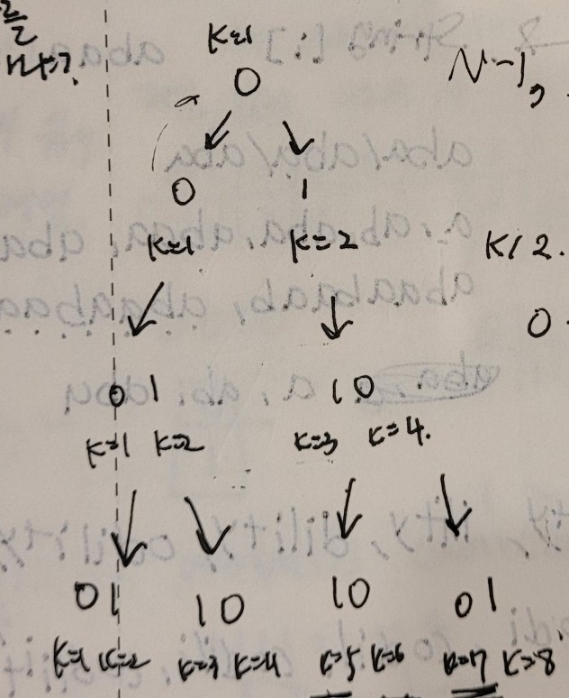
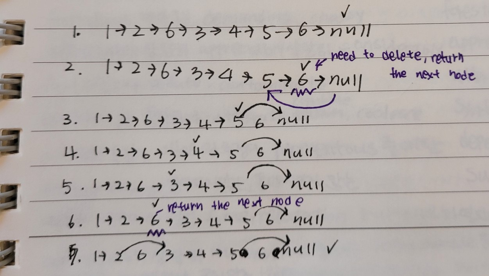

*leetcode 376*
>This is my version code.
```c++
ListNode* middleNode(ListNode* head) {
        int length = 0;
        int targetIndex = 0;
        ListNode* copyNode = head;

        for (ListNode* node = head; node != nullptr; node = node->next)
        {
            length++;
        }

        targetIndex = (length / 2) + 1;

        for (int i = 0; i < targetIndex - 1; i++)
        {
            if (copyNode->next != nullptr)
            {
        	   copyNode = copyNode->next;
            }
    	}
    	return copyNode;
}
```
>Other people's
```c++
public ListNode middleNode(ListNode head) {
    
    ListNode fastRunner = head;
    ListNode slowRunner = head;

    while(true){
        if(fastRunner == null || fastRunner.next == null) {
            break;
        }
        slowRunner = slowRunner.next;
        fastRunner = fastRunner.next.next;
    }

    return slowRunner;
  }
```
The fast pointer stops where behind the nullptr then the slow's position be the middle of the node because it is a single linked list and the pointer jump twice.
I thought the fast-slow method is good when I distinguish the thing is a cycle or not but I realize this method is also good for distinguishing the middle.

*leetcode 922*
>My version
```c++
vector<int> sortArrayByParityII(vector<int>& nums){
    int size = nums.size();
    int j = 0;
    for (int i = 0; i < size; i++) {
        if (i % 2 == 0 && nums[i] % 2 != 0) {
            while (true) {
                if (j % 2 == 1 && nums[j] % 2 == 0)
                {
                    break;
                }
                j++;
            }
            swap(nums[j], nums[i]);
        }
    }
    return nums;
}
```
>Other person's version
```c++
vector<int> sortArrayByParityII(vector<int>& nums) {

    for (int i = 0, j = 1; j < nums.size() && i.nums.size())
    {
        if (nums[i] % 2 == 0)
            i += 2;
        else if (nums[j] % 2 == 1)
            j += 2;
        else
            swap(nums[i], nums[j]);
    }
    return nums;
}
```
Since it checks even and odd indexes, it doesn't have to initialize only one variable or add one by one(like me, i++, and, i = 0). Just using +=2.
I didn't familiar with using the two variables at the for loop, but I realized the usage when I see this version.

*leetcode 104*
>My version
```c++
int maxDepth(TreeNode* root) {
    if (root == nullptr)
        return 0;
    int rightLength = 0;
    int leftLength = 0;
    int result = 0;

    rightLength = maxDepth(root->right);
    leftLength = maxDepth(root->left);

    result = 1 + (rightLength > leftLength ? rightLength : leftLength);

    return result;
}
```
>Other person's version
```c++
int maxDepth(TreeNode* root) {
    if (root == NULL) {
        return 0;
    }
    return max(maxDepth(root->right), maxDepth(root->left)) + 1;
}
```
When using algorithm max function, the runtime is 0 ms. If I use the max function, then I don't need to declare variables(like my version -> rightLength, leftLength, result).
And I think this part 
```c++ 
return max(maxDepth(root->right),maxDepth(root->left))+1;
``` 
is RVO, so the runtime reduced. Also, using the algorithm function reduces the runtime, but I don't know the reason(6/4).
Helpful link for understanding the recursion timeline: https://www.youtube.com/watch?v=YT1994beXn0

*leetcode 614*
>code
```c++
TreeNode* mergeTrees(TreeNode* root1, TreeNode* root2) {
    if (root1 == nullptr)
        return root2;
    if (root2 == nullptr)
        return root1;

    root1->val += root2->val;
    root1->left = mergeTrees(root1->left, root2->left);
    root1->right = mergeTrees(root1->right, root2->right);

    return root1;

}
```
I struggle with this problem. After spending 1 day, I determined that seeing the solution and after seeing the solution, I felt this problem is good to practice the recursion.
When I solving this problem, I knew the method that gets each value of the leaves but I didn't know how to store the values(each tree's leaf values). 
The first time, I used the map and vector to store the values but there was a problem that stores the nullptr.
```c++
if (root1 == nullptr)
    return root2;
if (root2 == nullptr)
    return root1;
```
However, as you can see, I don't need to store any values if I use the root. Just plus root2's value to root1.
If root1 is null, return root2 and accept the value as a result, then I also change the nullptr location's value to root2's value.

*Leetcode 461*
>my version
```c++
int hammingDistance(int x, int y) {
    int result = 0;
    bitset<32> x_bitset(x);
    bitset<32> y_bitset(y);

    for (int i = 0; i < x_bitset.size(); i++)
    {
        if (x_bitset[i] != y_bitset[i])
            result++;
    }

    return result;
}
```
I used the bitset header to get the bits of the x and y. After getting the bits, I compared the bits one by one.
For solving this question, I did study the bitset header usage.

>other person's version
```c++
int hammingDistance(int x, int y) {
    int n = x ^ y;
    int res = 0;
    while (n) {
        res += n & 1;
        n >>= 1;
    }
    return res;
}
```
This version using the XOR to get the result. I knew the XOR but I didn't think that using the XOR to solve this problem.
For example, if x is 5 and y is 1.
x 0101      0100    0100    0100
y 0001  ->  0001 -> 0010 -> 0100  
^ ----     &----   &----   &----
  0100      0000    0000    0100  = then the result += 1;
I think the XOR version is useful to pratice the XOR or bit operation.

*Leetcode 2*
I couldn't solve this problem so just understand write for the study.

```c++
ListNode* addTwoNumbers(ListNode* l1, ListNode* l2) {
    int carry = 0;

    ListNode* ans = new ListNode(-1);
    ListNode* temp = ans;

    while (l1 || l2 || carry != 0) {
        int no1 = l1 ? l1->val : 0;
        int no2 = l2 ? l2->val : 0;

        int sum = no1 + no2 + carry;

        temp->next = new ListNode(sum % 10);
        temp = temp->next;

        carry = sum / 10;

        l1 = l1 ? l1->next : l1;
        l2 = l2 ? l2->next : l2;
    }

    return ans->next;
}
```
Store the remainder to the temp->next. Since the temp is the ans's pointer, so the ans value is changed even if the temp value is changed.
Get the l1 and l2's sum value also the carry. The carry is increased when the sum exceeds 10. (sum/10)
After getting the sum between current nodes then change the node to the next node's value.
And repeat this until l1 or l2 be the nullptr.
When the l1 or l2 is nullptr or the carry is 0 then I can get the answer(stored the ans).

*Leetcode 13*
My one
```c++
int romanToInt(string s) {

    int size = s.length();
    int result = 0;
    string copy = s;
    std::map<char, int> dictionary;

    dictionary.insert(std::pair<char, int>('I', 1));
    dictionary.insert(std::pair<char, int>('V', 5));
    dictionary.insert(std::pair<char, int>('X', 10));
    dictionary.insert(std::pair<char, int>('L', 50));
    dictionary.insert(std::pair<char, int>('C', 100));
    dictionary.insert(std::pair<char, int>('D', 500));
    dictionary.insert(std::pair<char, int>('M', 1000));

    for (int i = 0; i < size; i++)
    {
        if (i == size - 1)
            continue;

        int compare1 = dictionary.find(copy[i])->second;
        int compare2 = dictionary.find(copy[i + 1])->second;

        if (compare1 >= compare2)
        {
            result += compare1;
        }
        else {
            int abs = std::abs(compare1 - compare2);
            result += abs;
            i++;
            if (i == size - 1)
            {
                return result;
            }
        }

    }

    result += dictionary.find(copy[size - 1])->second;
    return result;
}
```
Runtime: 24 ms, faster than 30.97% of C++ online submissions for Roman to Integer.
Memory Usage: 8.2 MB, less than 29.33% of C++ online submissions for Roman to Integer.

First, I thought I need to distinguish those letters so I made a map to store them. 
After storing, I compared two chars in order, and if the compare1 value smaller than compar2, I subtract two numbers and plus the i.
Because the two chars combined to the one string and the other situation just add the compare1 value.

Another one
```c++
int romanToInt(string s) {
    unordered_map<char, int> mp{
        {'I',1},
        {'V',5},
        {'X',10},
        {'L',50},
        {'C',100},
        {'D',500},
        {'M',1000},
    };
    int ans = 0;
    for (int i = 0; i < s.size(); i++) {
        if (mp[s[i]] < mp[s[i + 1]])
            ans -= mp[s[i]];
        else
            ans += mp[s[i]];
    }
    return ans;

}
```
It is similar to mine, but this one used an unordered map and did not use the insert function when initializing.
Also, this used the mp[s[i]], means the [] operator.
=> the [] operator returns the key's second value.
It is better to reduce the runtime because of not using the find function in every calculation.

*Leetcode - Remove Duplicates from Sorted Array*
```c++
int removeDuplicates(vector<int>& nums) {
    int size = nums.size();

    for (int i = size - 1; i > 0; i--)
    {
        if (i == 0)
            continue;

        if (nums[i] == nums[i - 1])
        {
            nums.erase(nums.begin() + i);
        }
    }

    return nums.size();
}
```
I checked all elements using linear search. 
If the first value(nums[i]) is equal with the second value(nums[i - 1]) then delete the first value.
After checking all values, then just return the size of the changed vector.

*Leetcode - Best Time to Buy and Sell Stock II*
```c++
int maxProfit(vector<int>& prices) {

    int result = 0;
    int size = prices.size();

    for (int i = 0; i < size; i++)
    {
        if (i == size - 1)
            continue;

        if (prices[i] < prices[i + 1])
        {
            result += prices[i + 1] - prices[i];
        }

    }

    return result;
}
```
For check the profit, I compared the first value(prices[i]) and the second value(prices[i + 1]). 
If the first value is greater than the second value, then I can profit because I can sell the stock more expensive than I bought.
After storing the calculated profit, keep checking values. And if the condition is met again, add the profit value to the result value.

*Leetcode - Rotate Array*
```c++

void rotate(vector<int>& nums, int k) {
    int s = nums.size();
    vector<int> modded(s);
    for (int i = 0; i < s; i++) modded[(i + k) % s] = nums[i];
    nums = modded;
}

void rotate(vector<int>& nums, int k) {
    int size = nums.size();
    int k_ = k % size;

    reverse(nums.begin(), nums.begin() + size - k_);
    reverse(nums.begin() + size - k_, nums.end());
    reverse(nums.begin(), nums.end());

}
```
I didn't solve this problem but I can get to how to approach (rotating formula and reverse way) the rotating.

The first one is the formula way.
If using the formula((i + k) % s) then I can get the remaining indexes(like after the index of the k-> example is 3 so we can get the 3 index = the array starts at 0, not 1, so it's right to get the index 3).
For example, if the k is 3 and the given array is [1,2,3,4,5,6,7], the result be [5,6,7,1,2,3,4].

i | (i + k) % s |    result
0 |     3       | m[3] = num[0]; 
1 |     4       | m[4] = num[1];
2 |     5       | m[5] = num[2];
3 |     6       | m[6] = num[3];
4 |     0       | m[0] = num[4];
5 |     1       | m[1] = num[5];
6 |     2       | m[2] = num[6];

After applying that formula, can get the result array.

The second one used the reverse way.
I can separate the array-like 0 to n-k, and n-k to n. ->the first separate one is [1,2,3,4] and the second separate one is [5,6,7].
If I reverse the first one then the array is [4,3,2,1] and the second one is [7,6,5].
And reverse the whole array the array be [5, 6, 7, 1, 2, 3, 4].
Then I can easily get the reversed array.

*Leetcode - Contains Duplicate*

```c++
bool containsDuplicate(vector<int>& nums) {
    bool result = false;
    vector<int> storage = nums;
    std::sort(storage.begin(), storage.end());

    for (int i = 0; i < storage.size(); i++)
    {
        if (i == storage.size() - 1)
            continue;

        if (storage[i] == storage[i + 1])
        {
            result = true;
            break;
        }
    }

    return result;
}
```

First, I thought compare all values using two for loops. 
For example,
```c++
for(int i = 0; i < storage.size(); i++){
    int compare = storage[i];
    for(int j = 0; j < storage.size(); j++)
    {
        if(compare == storage[j])
        {
            result = true;
            break;
        }
    }
}
```
but this way's time complexity is O(n^2), so I used the std::sort function.
If the array is sorted then I can check the duplicated values by only using one for loop(linear search).
The sort function's time complexity is O(n log n) so it's better than the second way.

*Leetcode - Single number*

my one
```c++
int singleNumber(vector<int>& nums) {
    vector<int> storage = nums;
    sort(storage.begin(), storage.end());
    int size = nums.size();
    int result = 0;
    bool check = false;

    for (int i = 0; i < size - 1; i++)
    {
        if (storage[i] == storage[i + 1])
        {
            i++;
            continue;
        }
        else {
            check = true;
            result = storage[i];
            break;
        }
    }

    if (!check)
        result = storage[size - 1];

    return result;
}
```
I thought if I used sorting then I can find the single number by searching the first(storage[i]) and the second value(storage[i+1]).
but I found better ways to solve this problem.
If I use the return, I don't need to use the bool variable.
Below is the improved version.
```c++
int singleNumber(vector<int>& nums) {
    vector<int> storage = nums;
    sort(storage.begin(), storage.end());
    int size = nums.size();
    int result = 0;
    bool check = false;

    for (int i = 0; i < size - 1; i += 2)
    {
        if (storage[i] != storage[i + 1])
        {
            return storage[i];
        }

    }
    return storage[size - 1];
}
```

And can solve this problem by using the map.
I also thought about using the map to solve this problem.
But I'm not familiar with using the map so I just used the first way.

another one using map
```c++
int singleNumber(vector<int>& nums) {
    unordered_map<int, int> a;
    for (auto x : nums)
        a[x]++;
    for (auto z : a)
        if (z.second == 1)
            return z.first;
    return -1;
}
```
This is another person's answer for using a map.
After passing the for loop, the map stored values in ascending order.
For example, if the nums vector content [1,1,2,2,3], then the map's content be (1,2) | (2,2) | (3,1)
so I can get the single number through the map's second value.

*Leetcode - Intersection of Two Arrays II*

my one
```c++
vector<int> intersect(vector<int>& nums1, vector<int>& nums2) {
    map<int, int> store1;
    map<int, int> store2;
    vector<int> result;

    for (auto num : nums1)
    {
        store1[num]++;
    }

    for (auto num : nums2)
    {
        store2[num]++;
    }

    for (std::map<int, int>::iterator it = store1.begin(); it != store1.end(); it++)
    {
        int compare = it->first;
        std::map<int, int>::iterator iter = store2.find(compare);
        int count = min(iter->second, it->second);
        for (int i = 0; i < count; i++)
        {
            result.push_back(iter->first);
        }
    }
    return result;
}
```
I used map STL to compare the values.
First, store the values of each map.
After storing, then the result be (if the nums1 [4,9,5] and the nums2 [9, 4, 9, 8, 4])
store1: (4, 1) | (5, 1) | (9, 1)
store2: (4, 2) | (8, 1) | (9, 2)
=>The map sorts values in ascending order automatically. 

Second, find the iterator that has the same first value by using the for-loop.
If succeed at finding the value, then push_back the iterator's second value as the minimum value between two iterator's values.

the another one
```c++
vector intersect(vector& nums1, vector& nums2) {

    vector<int> ans;

    sort(nums1.begin(), nums1.end());
    sort(nums2.begin(), nums2.end());

    for (int i = 0, j = 0; i < nums1.size() && j < nums2.size(); )
    {
        if (nums1[i] < nums2[j])
            i++;
        else if (nums1[i] > nums2[j])
            j++;
        else
        {
            ans.push_back(nums1[i]);
            i++;
            j++;
        }
    }
    return ans;
}
```
Above answer is the 100% fastest version.
This answer used sorting and for-loop that using two initial variable.
If the nums[i] < num2[j] then increase the i value, in the opposite situtaion, increase j value.
For example, the nums1 is [1, 2, 2, 1] and the nums2 is [2, 2].
After sorting two container, the nums1 be [1, 1, 2, 2] and the nums2 [2, 2].
In the for-loop, the i is increase when the i and j are 0.
When the condition that two values are same is met, then push_back the value because it means the value is same.

*Leetcode - Plus One*

```c++
vector<int> plusOne(vector<int>& digits) {
    vector<int> result;
    int size = digits.size();

    for (int i = size, index = size - 1; i > 0; i--, index--)
    {
        int count = digits[index] + 1;
        if (count == 10)
        {
            if (index - 1 < 0)
            {
                digits[index] = 1;
                digits.push_back(0);
            }
            else {
                digits[index] = 0;
            }
        }
        else {
            digits[index]++;
            return digits;
        }
    }
    return digits;
}
```
First, start at the end of the vector and just plus one to the element.
If the element value is under 9, don't need to think about the digit number, but if the value is over 9, then it means the digit number is increased. 
For example, if the element value is 9 and after plus one, the digit number is increased from 1 to 2. (1 -> 10)
And if that situation(digit number increased), the index value be 0, but if the former index is not assigend than the index value be 1 and push back 0 to the end.
For example, if the value is 9 then the value(index - 1) is -1, it means the index is out of range.
So changed the index value 1 and push back 0 to the end, the result be [1, 0].

*Leetcode - Move Zeros*

```c++
void moveZeroes(vector<int>& nums) {
    int size = nums.size();

    if (size == 1)
        return;

    int zeroCount = 0;
    bool flag = false;

    for (int i = 0; i < size; i++)
    {
        if (nums.size() == 0 || i > nums.size() - 1)
            break;

        if (flag)
        {
            i = 0;
            flag = false;
        }
        if (nums[i] == 0)
        {
            nums.erase(nums.begin() + i);
            zeroCount++;
            flag = true;
        }
    }

    for (int i = 0; i < zeroCount; i++)
    {
        nums.push_back(0);
    }
}
```
First, I thought to get the frequency of zeros and erase the zero value when encountering the nums[i] is 0.
Second, after deleting all zeros, push_back the zero.
The flag and size == 0 are conditions to avoid the out-of-range error.

```c++
void moveZeroes(vector<int>& nums) {
    int size = nums.size();

    if (size == 1)
        return;

    int zeroCount = 0;
    bool flag = false;

    for (int i = 0; i < nums.size(); i++)
    {
        if (nums[i] == 0)
        {
            nums.erase(nums.begin() + i);
            i--;
            zeroCount++;
        }

    }

    for (int i = 0; i < zeroCount; i++)
    {
        nums.push_back(0);
    }
}
```
The second version is an improved version.
The first time, I tried this version that deleting the zero number by using nums.begin() + i;
But when I tried that, I didn't think about the i-- and I used the stored size(line 741).
If I changed to nums.size() then I don't need to think about the out-of-range error.

*Leetcode - Two sum*

my one
```c++
vector<int> twoSum(vector<int>& nums, int target) {
    int size = nums.size();
    for (int i = 0; i < size; i++)
    {
        int findValue = target - nums[i];
        for (int j = 0; j < size; j++)
        {
            if (i == j)
                continue;

            if (nums[j] == findValue)
            {
                return { i,j };
            }
        }
    }
    return { -1,-1 };
}
```
I used brute force way. 
Find the findvalue(target = num1 + num2 => num1 = target - num2) from the second for loop and return the vector right away.

another one - using hash map(unordered_map using hash table)
```c++
vector<int> twoSum(vector<int>& nums, int target) {
    unordered_map<int, int>mp;
    int size = nums.size();
    for (int i = 0; i < size; ++i)
    {
        int diff = target - nums[i];
        if (mp.find(diff) != mp.end())
        {
            return { mp[diff],i };
        }
        mp.insert({ nums[i],i });
    }
    return {};
}
```
I am not familiar with using a hash map(unorderded_map).
So after solving the problem using brute force, I tried to solve this problem using the hash map.
But I failed to find other person's answers and understand the way.

First, if cannot find the diff value(=find value), insert the value({nums[i],i}).
For example, the nums are [2, 7, 11, 15] and the target value is 9.
In the first loop(i = 0), there is no value cause it's an empty one so insert the value.
In this case, the (2,0) will be stored in a map container.
And when the i = 1, the diff value is 2.
In the map, there is a value that has a 2(key value) so can enter the if statement.
And if succeed to find the value, it means it finds the two sums' vector.
So return the {mp[diff],i}.
In this case, the returned vector is {mp[2], 1} => { 0, 1 }.

i | num[i] | diff | insert | return      | mp[]
0 |   2    |  7   |  (2,0) |   X         | (2,0)
1 |   7    |  2   |    X   | O => {0, 1} | (2,0)

*Leetcode - Valid Sudoku*

my one
```c++
class Solution {
public:
    bool isValidSudoku(vector<vector<char>>& board) {
        
        //x check
        for(int y = 0; y < 9; y++)
        {
            unordered_map<char, int> m;
            for(int x = 0; x < 9; x++)
            {   
                if(board[y][x] == '.')
                    continue;

                m[board[y][x]]++;
                
                if(m[board[y][x]] > 1)
                    return false;
            }
            m.clear();
        }
        
        //y check
        for(int x = 0; x < 9; x++)
        {
            unordered_map<char, int> m;
            for(int y = 0; y < 9; y++)
            {
                if(board[y][x] == '.')
                    continue;
                
       
                m[board[y][x]]++;
                
                if(m[board[y][x]] > 1)
                     return false;
                     
            }
            m.clear();
        }
        
        //grid check
        int xAdd = 0;
        int yAdd = 0;
        int count = 0;
     
        while(count != 9)
        {
            if(xAdd == 9)
                xAdd = 0;
                
            unordered_map<char, int> m;
            for(int y = yAdd; y < yAdd + 3; y++)
            {
                for(int x = xAdd; x < xAdd + 3; x++)
                {    
                    if(board[y][x] == '.')
                        continue;

                    m[board[y][x]]++;
                    
                    if(m[board[y][x]] > 1)
                        return false;
                }
            }
            count++;
            m.clear();
            xAdd += 3;
            
            if(count % 3 == 0)
                yAdd +=3;
        }
        
        return true;
        
    }
};
```
I used an unordered_map to know the repetition.
And separate three conditions into row check, column check, and sub 3x3 check.
The way that checking repetition is storing values to the m.
For example, if there is a char '5' in the board[1][1], then the char be the key value and increase the second value if the value exists.
And, suppose to there is a duplicate char '5' in the board[2][1], this means it is not valid sudoku cause there is a repetition in the same column.
So the m['5'] = 2. => exceed 1, succed to find duplicate value!


another one
```c++
bool isValidSudoku(vector<vector<char>>& board) {
    vector<unordered_set<int>> rows(9, unordered_set<int>());
    vector<unordered_set<int>> columns(9, unordered_set<int>());
    vector<unordered_set<int>> boxes(9, unordered_set<int>());

    for (int i = 0; i < 9; ++i) {
      for (int j = 0; j < 9; ++j) {
        if (board[i][j] == '.')
          continue;

        int num = board[i][j] - '0';

        if (rows[i].count(num))
          return false;

        if (columns[j].count(num))
          return false;

        // This is a straight-forward math formula to locate a box
        // Out of the 9 boxes
        int box_index = (i / 3) * 3 + j / 3;

        if (boxes[box_index].count(num))
          return false;

        rows[i].insert(num);
        columns[j].insert(num);
        boxes[box_index].insert(num);
      }
    }

    return true;
}
```
This version used three variables to store columns, rows, and boxes.
To get the number, check the duplicate values by using the unordered_set's count function.
The count function returns the number of elements found.
The unordered_set containers do not allow for duplicate values, this means that the function actually returns 1 if an element with that value exits in the container, and zero otherwise.
If the return value is 1, then return false cause it's not valid sudoku that has a repetition number in the row or column or box.

And for checking the sub-boxes, using the math formula from this formula, can get the sub-boxes index for the 3x3 box.
For example,
if there is a number 5 in the (1,1) cell, the box index is 0.
After inserting the number, the 5 is stored in the boxes[0]. =>first sub-box's element.
And if there is a number in the (3,0) cell, the box index is 1. => second sub-box's element.

After getting a box index, insert the value into the vector array.
For the row, insert to the y index, and for the column, insert to the x index.
For the box, just use box_index.

*Leetcode - reverse string*

my one
```c++
class Solution {
public:
    void reverseString(vector<char>& s) {
        for(int i = 0, j = s.size() - 1; i < s.size() / 2; i++, j--)
        {
            swap(s[i], s[j]);
        }
    }
};
```
Get the two variables to point first and end and just swap two values.
For example, if the s is [1, 2, 3, 4, 5], i is 0 and j is 4.
First iteration result is [5, 2, 3, 4, 1].
Second iteration result is [5, 4, 3, 2, 1].
The for loop works until s.size() / 2 so the second iteration will be an answer.


*Leetcode - Rotate Image*

my one
```c++
class Solution {
public:
    void rotate(vector<vector<int>>& matrix) {
        
        for(int i = 0; i < matrix.size(); i++)
        {
            for(int j = i + 1, index = i + 1; j < matrix.size(); j++, index++)
            {
                swap(matrix[i][j], matrix[index][i]);
            }
            
        }
        
        for(int i = 0; i < matrix.size(); i++)
        {
            reverse(matrix[i].begin(), matrix[i].end());
        }
    }
};
```
I didn't solve this problem on my own so I searched for this problem and how to solve it.
First, the first column matrix transposes the row matrix.
For example, if the matrix is 
[1  2  3  4]
[5  6  7  8]
[9  10 11 12]
[13 14 15 16], the first column is [1,5,9,13] and make this column to row then the result be

[1 5  9  13]
[2 6  7  8]
[3 10 11 12]
[4 14 15 16].

This operation applies to all columns then the final result be
[1 5 9  13]
[2 6 10 14]
[3 7 11 15]
[4 8 12 16].

After gaining this result, reverse this matrix.
[13 9  5 1]
[14 10 6 2]
[15 11 7 3]
[16 12 8 4].
I can get the result.

I think I'm not good at solving the in-placea problem.
Need to practice more problems.

*Leetcode - Reverse integer*

```c++
class Solution {
public:
    int reverse(int x) {
        int max = std::numeric_limits<int>::max();
        int min = std::numeric_limits<int>::min();
        
        int result = 0;
        bool flag = false;
        
        string str = to_string(x);
        
        if(x < 0)
        {
            flag = true;
            str.erase(str.begin());
        }
        
        int stringSize = str.size();
        int checkingValue = 0;
        
        for(int i = stringSize - 1; i >= 0; --i)
        { 
            int integer = str[i] - 48;
                        
            if(i > 8 && integer > 2)
                return 0;
            
            if(i == 0 && integer == 0)
            {
                break;
            }
            
            int multipliedValue = pow(10, i);
            checkingValue = max - result;
            
            if(multipliedValue * integer > checkingValue)
                return 0;
            
            result += integer * multipliedValue;
        }
        
        if(flag)
            result *= -1;
        
        return result;
    }
};
```
I thought it needs to convert the integer value to a string value.
So I used the to_string() function => it converts an integer value to a string value like 123 -> "123". 
And for getting the integer value from the string, subtract 48(the decimal value of the char '0') to each string element cause I just need numbers 0 to 9.
For a negative value, I checked the value at the beginning, so if the condition is met(x < 0) then multiply -1 to the resulting number.
Also, I need to check the integer range.
If the reversed integer value exceeds the int range([-2^31, 2^31 -1]), it causes an error. 
For checking the range, I used the checking variable.  
```c++
            checkingValue = max - result;
            
            if(multipliedValue * integer > checkingValue)
                return 0;
```
The max - result value is stored in the checking value.
If the multipliedValue * integer value exceeds the checking value, it means the addedValue causes the range error.
For example, suppose an example value is 2147483651. This value exceeds the maximum value of 51.
So in that example, the checking value is 47 and the added value is 50. Added value is greater than the checking value, returned 0.

another one
```c++

class Solution {
public:
    int reverse(int x) {
        int res = 0;
        while(x){
            if(res > INT_MAX/10 || res < INT_MIN/10)
                return 0;
            res = res*10 + x%10;
            x /= 10; 
        }
        return res;
    }
};
```
I found a clever solution to this problem.
The (number % 10) gives the last digit number.
For example, if the value is 123 then the value % 10 is 3 -> the last digit.
So if using that calculation, I can get the reversed number.
Suppose an example number is 123.

iteration | x % 10 |   x    | res |
    0     |   -    |   -    | 0   |
    1     |   3    |   123  | 3   |
    2     |   2    |   12   | 32  |
    3     |   1    |   1    | 321 |

For the range check, using res > INT_MAX/10 and res < INT_MIN / 10.

*leetcode - First unique character in a string*

```c++
class Solution {
public:
    int firstUniqChar(string s) {
        unordered_map<char, int> um;
        for(auto str : s)
        {
            um[str]++;
        }
        
        bool flag = false;
        for(auto iter : um)
        {
            if(iter.second % 2 == 1) //if met the conditon even once, it means need to return the index
            {
                flag = true;
            }
        }
        
        if(!flag)
            return -1;
        else{
            int minimumIndex = s.size() - 1;
            bool check = false;
            for(auto iter : um)
            {
                if(iter.second ==  1)
                {
                    check = true;
                    int index = s.find(iter.first);
                    if(minimumIndex > index)
                        minimumIndex = index;
                }
            }
            
            if(!check)
                return -1;
            
            return minimumIndex;
        }
        
    }
};
```

I used an unordered_map for counting the chars of the string.
After counting chars, I classified conditions to know whether the string is repeated or not.
If the second value's remainder is 0, it means the string is repeated because it's an even, on the other hand, it needs to return the first non-repeating index.
However, there is a case where the string is repeated even if all second values are odd.
Suppose the string is aabbbaa, it is a repeated string so also need to consider this situation.
So I added the iter.second == 1 if statement.
It can filter that odd repeated situations. 
I solved this problem but am not sure it is a clever way to solve this problem. 
So I will find other answers.

another one
```c++

class Solution {
public:
    int firstUniqChar(string s) {
        unordered_map<char, int> m;
        for (char& c : s) {
            m[c]++;
        }
        for (int i = 0; i < s.size(); i++) {
            if (m[s[i]] == 1) return i;
        }
        return -1;
    }
};

```
Maybe I thought too hard. 
I can get the second value by m[s[i]].
The first value is the key in the map and I stored the key value from the string, so if just using the string s as finding a value, it is so easy to find the first unique value.
So if I check the value from the first element of the string to the end, I can get the first unique char value.
I am not familiar with using the [] operator of the map so this problem is good to practice about using the map.

*leetcode - Valid Anagram*

my one
```c++
class Solution {
public:
    bool isAnagram(string s, string t) {
        unordered_map<char, int> u_map1;
        unordered_map<char, int> u_map2;
        
        for(char str : s)
        {
            u_map1[str]++;
        }
        
        for(char str : t)
        {
            u_map2[str]++;
        }
        
        if(u_map1.size() != u_map2.size())
            return false;
            
        for(auto iter = u_map1.begin(); iter != u_map1.end(); iter++)
        {
            if(iter->second != u_map2[iter->first])
                return false;
        }
        
        return true;
    }
};
```
I used the hash map(unordered_map) for getting letters frequency of the string.
After getting the map value(two for loops), I used a iteration for checking the value is same.

another one
```c++
class Solution {
public:
    bool isAnagram(string s, string t) {
        
        if(s.size() != t.size())
            return false;
        
        unordered_map<char, int> u_map1;
        unordered_map<char, int> u_map2;
        
        for(int i = 0; i < s.size(); i++)
        {
            u_map1[s[i]]++;
            u_map2[t[i]]++;
        }
            
        for(auto iter = u_map1.begin(); iter != u_map1.end(); iter++)
        {
            if(iter->second != u_map2[iter->first])
                return false;
        }
        
        return true;
    }
};
```
My one used two for loops for getting the value but this one just used one for loop.
If two strings length is not same, I don't need to think about setting the hash map.
So just using string's size function, I can set up the hash map.

*Leetcode - Valid Palindrome*

my one
```c++
class Solution {
public:
    bool isPalindrome(string s) {
        
        string container;
        for(int i = 0; i < s.length(); i++)
        {
            if(s[i] >= 65 && s[i] <= 90) // if a char is a upper alphabet, convert to lower alphabet
            {
                container.push_back(s[i] + 32);
            }    
            if(s[i] >= 48 && s[i] <= 57) // if a char is a number
            {
                container.push_back(s[i]);
            }  
            else if(s[i] >= 97 && s[i] <= 122){ // non-alphabet -> delete
                container.push_back(s[i]);
            }
        }
        
        string str(container);
        reverse(str.begin(), str.end());

        for(int i = 0; i < container.length(); i++)
        {
            if(str[i] != container[i])
                return false;
        }
            
        return true;
    }
};

class Solution {
public:
    bool isPalindrome(string s) {
        
        for(int i = 0; i < s.length(); i++)
        {
            if(s[i] >= 'A' && s[i] <= 'Z') // if a char is a upper alphabet, convert to lower alphabet
            {
                s[i] += 32;
            }    
            else if(s[i] < 'a' || s[i] > 'z') { // non-alphabet -> delete
                
                if(s[i] >= '0' && s[i] <= '9')
                    continue;
                
                s.erase(s.begin() + i);
                i--;
            }
        }
        
        int size = s.length() / 2;
        for(int i = 0, j = s.length() - 1; i < size; i++, j--)
        {
            if(s[i] != s[j])
                return false;
        }
            
        return true;
    }
};
```
The first one uses additional containers(string) and reverse.
Only push back lower and number chars, and assign a new string to reversed container string.
And comparing each char of both.
The second one does not assign additional memory allocation, just modifies the original input string.
After modifying the string, use two variables (start from first to end, start from end to first) for comparison.

another one
```c++
bool isPalindrome(string s) {
    int start=0, end=s.length()-1;
    while(start<end) {
        if (!isalnum(s[start])) start++;
        else if (!isalnum(s[end])) end--;
        else {
            if (tolower(s[start++])!=tolower(s[end--])) return false;
        }
    }
    return true;
}
```
The above code uses two pointers.
The first pointer is the beginning of the string and the second pointer is the end of the string.

FYI
isalnum(): return true if the char is alphabet or number, otherwise return false.
tolower(): convert the upper alphabet to the lower alphabet.

if the start index value is not alphabetical or number then don't need to check that, so increase by 1.
Likewise, the second else if statement is the same, but decreases by 1.
The last else statement is checking the alphabet using the tolower function.
If the start index and end index values are not the same, it means it is not a Valid Palindrome.

I didn't know two functions(isalnum, tolower), so it's a worth problem because of the two functions and how to use the two pointers.

*Leetcode - string to interger(atoi)*
my one
```c++
class Solution {
public:
    
    int CheckWhitespace(string s)
    {
        int result = 0;
        int i = 0;
        while(true)
        {
            if(s[i]==' ')
                result++;
            
            if(s[i] != ' ')
                return result;
            
            i++;
        }
    }
    
    void CheckingTwoStep(bool& negative, int& i, string inputString, string& str_){  
        
        if(inputString[i] == ' ')
        {
            i = CheckWhitespace(inputString);
        }
        
        if(inputString[i] == '-' || inputString[i] == '+')
        {
            if(inputString[i] == '-')
            {
                negative = true;
                str_.push_back('-');
            }
            else{
                str_.push_back('+');
            }
            i++;
                
        }
    }
    
    int myAtoi(string s) {

        int result = 0;
        int i = 0;
        int size = s.length();
        string str;
        bool negative = false;
        
        CheckingTwoStep(negative, i, s, str);
        
        while(i < size)
        {          
            if(s[i] >= '0' && s[i] <= '9') // check it is digit
            {
                str.push_back(s[i]);
            }
            else{
                i = size;
            }
            
            i++;
        }
        
        
        for(int i = 0; i < str.length(); i++)
        {
            if(str[i] == '-' || str[i] == '+')
                continue;
            
            if(str[i] == '0')
            {
                str.erase(str.begin() + i);
                i--;
            }
            else{
                i = str.length();
            }
                
        }
        
        int finalSize = str.length();
        for(int i = finalSize, j = 0; i > 0; i--, j++)
        {
            if(str[i - 1] == '-' || str[i-1] == '+')
            {
                continue;
            }
                
            if(negative)
            {               
 
                if(j > 9)
                    return INT_MIN;
                
                int pop = -((int)(str[i - 1]) - 48);
                
                if(j == 9 && pop < -2)
                    return INT_MIN;
                
                int addedAmount = pop * pow(10, j);
                
                if(result < (INT_MIN - addedAmount))
                {
                    return INT_MIN;   
                }
                
                result += addedAmount;
            }
            else{
                
                if(j > 9)
                    return INT_MAX;
                
                int addedAmount = 0;
                int pop = ((int)(str[i - 1]) - 48);
                
                if(j == 9 && pop > 2)
                    return INT_MAX;
                
                addedAmount += pop * pow(10 , j);
                
                if(result > INT_MAX - addedAmount)
                {
                    return INT_MAX;   
                }
                
                result += addedAmount;
 
            }
        }
        
        return result;
        
    }
};
```
I used an additional memory allocation for getting the string that only contains digit chars.
First, I created a helper function for checking cases that ignore leading whitespaces and signs(+ or -).
After through the helper function, read digit chars if encountered a non-digit char move out of the for loop.
For converting chars to integers, I used the pow function and set up the start index at the end of the string.
For the range check, if the j value exceeds 9 return INT_MAX or INT_MIN.
Using the INT_MAX - addedAmount for preventing the result value exceeds the 32-bit integer overflow value.

I could solve this problem but I'm not sure this is a good way to solve it.

another one
```c++
class Solution {
public:
   
    int myAtoi(string s) {
  
        // helper variables
        int res=0;
        int i=0;
        int sign=1;
        
        while(i<s.size()&&s[i]==' ')i++;  //ignore leading white space
        
        if(s[i]=='-'||s[i]=='+')          //check if number positve or negative
        {
            sign=s[i]=='-'?-1:1;
            i++;
        }
        // now iterate across digits if any
        // should only be in range 0-9
        while(i<s.length()&&(s[i]>='0'&&s[i]<='9'))  //traverse string till nondigit not found or string ends
        {
            int digit=(s[i]-'0')*sign;
            if(sign==1 && (res>INT_MAX/10 || (res==INT_MAX/10 && digit>INT_MAX%10))) return INT_MAX; //check for overflow
            if(sign==-1 &&(res<INT_MIN/10 || (res==INT_MIN/10 && digit<INT_MIN%10))) return INT_MIN; //check for underflow
            
            res=res*10+digit; // update res
            i++;
        }
    
    return res;
    }
};
```
For checking leading white spaces and signs are similar but the most different is dealing with the overflow.
I saw others using the equation(res = res x 10 + digit;) to get the integer.
I really need to familiarize myself with that equation for later.
```c++
(res == INT_MAX / 10 && digit > INT_MAX % 10)
```
The above equation means the last digit greater than the last digit of an integer maximum value.
For example, if the value is 2147483649, the last digit value is greater than the last digit of a maximum integer so success to check the overflow.
```c++
(res>INT_MAX/10)
```
The above equation checks the result that after addition causes the overflow.
For example, if the value is 6541237895, the statement works when comparing between 65412378 and 214748364.
Because the first one is greater than the maximum value it causes overflow so return INT_MAX.


*Leetcode - Longest Common Prefix*

```c++
class Solution {
public:
    string longestCommonPrefix(vector<string>& strs) {
        if (strs.empty()) return "";
        for (int len = 0; ; ++len) {
            char c = strs.front()[len];
            for (auto& s: strs)
                if (s.size() <= len || s[len] != c)
                    return strs.front().substr(0, len);
        }
    }
};
```
This answer uses the substr function for solving this problem.
Use substr function if the size is less than the index and the compared value is not matched with the compare value.

*Leetcode - Delete Node in a Linked List*

```c++
class Solution {
public:
    void deleteNode(ListNode* node) {
        
        for(ListNode* nodePtr = node; nodePtr != nullptr; nodePtr  = nodePtr->next)
        {
            nodePtr->val = nodePtr->next->val;
            
            if(nodePtr->next->next == nullptr)
            {
                nodePtr->next = nullptr;
                break;
            }
        }
        
    }
    
};
```
In this problem, access to the head node is not provided.
So I used the way that copies the next node value of the current node to the current node.
I can pass all test cases, but the runtime and memory are not good.

another one
```c++
void deleteNode(ListNode* node) {
    *node = *node->next;
}
```
Just let the given node point to the next node of the current node.

*Leetcode - Remove Nth Node From End of List*

```c++
class Solution {
public:
    ListNode* removeNthFromEnd(ListNode* head, int n) {
        
          int totalSize = 0;
        for(auto ptr = head; ptr!=nullptr; ptr = ptr->next)
        {
            totalSize++;
        }
        
        if(totalSize == 1)
        {
            return NULL;    
        }
        
        int indexFromBeginning = totalSize - n;
        
        ListNode* temp = NULL;
        ListNode* ptr = head;
        
        if(indexFromBeginning == 0)
        {
            *head = *head->next;
            return head;
        }
        
        while(indexFromBeginning > 0)
        {
            temp = ptr;
            ptr = ptr->next;
            indexFromBeginning--;
        }
        temp->next = ptr->next;
        
        
       return head;
    }
};
```
First, need to get the list size and target index(indexFromBeginning) by list size.
After getting both, declare the ListNode dummy variable (to get a previous node of a deleted node) and ptr(pointing to the head node).
Make a for loop to iterate that until the index becomes 0.
If the index value is less than 0, make the temp's next be ptr->next;
For example, the inputs are [1,2,3,4,5] and n is 2.
The temp node be 3 and the ptr be 4, so after temp->next = ptr->next
the linked list will be 1->2->3->5.

another one
```c++
class Solution {
public:
    ListNode* removeNthFromEnd(ListNode* head, int n) {

    ListNode* node = head, *offsetNode = head;
    for (int i = 0; i < n; ++i)
        node = node->next;
    
    // if node is NULL n is equal to the length of the linked list and we have to remove the head
    if (node == NULL)
        return head->next;
    
    while (node->next != NULL) {
        node = node->next;
        offsetNode = offsetNode->next;
    }
    
    offsetNode->next = offsetNode->next->next;
    
    return head;
}
```
It's a way to use two-pointers.
First, getting a node that stays away by n.
And make the node reaches until end fo the list.
Suppose the input is [1,2,3,4,5] and 2.
After the while loop, the node will be 5 and the offsetnode will be 3.
Then make offsetnode's next node be offsetnode's next->next node.

*Leetcode - Reverse Linked List*
my one
```c++
class Solution {
public:
    ListNode* reverseList(ListNode* head) {
        
        if(head==nullptr)
            return NULL;
        
        stack<int> st;
        
        for(auto ptr = head; ptr != nullptr; ptr = ptr->next)
        {
            st.push(ptr->val);
        }
        
        for(auto ptr = head; ptr != nullptr; ptr = ptr->next)
        {
            ptr->val = st.top();
            st.pop();
        }

        return head;
    }
};
```
I used a stack container.
Push the list's value to the stack and get the last value by top() and change the node's value to that.

```c++
//Iteratively
class Solution {
public:
    ListNode* reverseList(ListNode* head) {
        ListNode *nextNode, *prevNode = NULL;
        while (head) {
            nextNode = head->next;
            head->next = prevNode;
            prevNode = head;
            head = nextNode;
        }
        return prevNode;
    }
};

//Recursively
class Solution {
public:
    ListNode* reverseList(ListNode *head, ListNode *nextNode = NULL, ListNode *prevNode = NULL) {
        return head ? reverseList(head->next, (head->next = prevNode, nextNode), head) : prevNode;
    }
};
```
Using three variable, previous node, current node and next node.
The previous note points to previous node of the current node and the next node points to the next node of the current node.
First, initialize the previous and next node to null.
and make the current node points to the previous node, it means that chaning the direction.
And assign the previous node to the current node and the head to the next node.
https://leetcode.com/explore/featured/card/top-interview-questions-easy/93/linked-list/560/discuss/803955/C++-Iterative-vs.-Recursive-Solutions-Compared-and-Explained-~99-Time-~85-Space?page=1
It's hard to explain using sentence. The above link's gif shows it well.

*Leetcode - Merge two sorted lists*

```c++
class Solution {
public:
    ListNode* mergeTwoLists(ListNode* list1, ListNode* list2) {
        
        ListNode result;
        ListNode* tail = &result;
        
        while(list1 != nullptr && list2 != nullptr)
        {
            if(list1->val <= list2->val)
            {
                tail->next = list1;        
                list1 = list1->next;
            }
            else if(list1->val > list2->val) 
            {
                tail->next = list2;        
                list2 = list2->next;
                
            }
            tail = tail->next;
        }
        
        if(list1 !=nullptr)
            tail->next = list1;
        else
            tail->next = list2;
        
        return result.next;
    }
};
```
Using a dummy for solving. 
First create a dummy node and make a tail node that points to the last node of dummy.
And create a while loop for checking each lists' value.
Make the tail's next node point to a less value node.
And make the tail's next node to non-nullptr node of list1 or list2 because the previous while loop ends at the previous node of the end of the list.

*Leetcode - Palindrome Linked List*
```c++
bool isPalindrome(ListNode* head) {

    //using another data container. time complexity: O(n), space complexity: 
    stack<int> stk;
        
    for(auto ptr = head; ptr != nullptr; ptr = ptr->next)
    {
        stk.push(ptr->val);
    }
        
    int size = stk.size();
        
    for(int i = 0; i < size / 2; i++)
    {
        if(head->val != stk.top())
            return false;
            
        stk.pop();
        head = head->next;
    }
    return true;
        
    //Floyd's Cycle Detection Algorithm. space complexity:O(1) time complexity: O(N)
    ListNode* fast = head, *slow = head, *prev, *temp;
        
    while(fast && fast->next)
    {
        slow = slow->next;
        fast = fast->next->next;
    }
        
    prev = slow; slow=slow->next; prev->next = NULL;
    while(slow)
    {
        temp = slow->next;
        slow->next = prev;
        prev = slow;
        slow = temp;
    }
        
    slow = prev; fast = head;
    while(slow)
    {
        if(slow->val != fast->val)
            return false;
        slow = slow->next;
        fast = fast->next;
    }
        
    return true;
}
```
The first way is just using another data container to copy the list's values.
And compare the values using the container.

The second way is using Floyd's Cycle Detection Algorithm.
The algorithm uses two pointers, fast and slow, and these pointers have different speeds. 
If the fast pointer reaches the end of the list, the slow pointer must point to the middle of the list.

For example, if the input is [1,6,4,5,4,6,1], the fast pointer points to 1 and the slow pointer points to 5.
Because the slow pointer is in the middle of the list, I can make the back half of the list reverse.
Using the prev variable(points to the previous node of the current node) and temp variable(points to the next variable of the current node) makes the list reverse.
After while loop, the list will be from 1 -> 6 -> 4 -> 5 -> 4 -> 6 -> 1 to 1 -> 6 -> 4 -> 5 <- 4 <- 6 <- 1.
Lastly, make the slow pointer point to the last and the fast pointer point to the head.
And compare the values if the value is not equal the list is not a palindrome. 

*Leetcode - Linked List Cycle*
```c++
bool hasCycle(ListNode* head) {
    ListNode* fast = head;
    ListNode* slow = head;
    while (fast != nullptr && fast->next !=nullptr)
    {
        slow = slow->next;
        fast = fast->next->next;
        if (fast == slow)
            return true;
    }
    return false;
        
}

```
Using two pointers for checking the list is cycled.
The fast pointer points to next next node of the current node and the slow node point to the next node of the current node.
The fast->next is for checking the odd-size list.

*Leetcode - Binary Tree Level Order Traversal*
```c++
  vector<vector<int>> vec;
        
        if(root == nullptr)
            return vec;
        
        queue<TreeNode*> que;
        que.push(root);
        
        while(!que.empty())
        {
            vector<int> vec2;
            int size = que.size();
            
            for(int i = 0; i < size; i++)
            {
                TreeNode* node = que.front();
            
                if(node->left != nullptr)
                    que.push(node->left);
                if(node->right != nullptr)
                    que.push(node->right);
                
                vec2.push_back(node->val);
                que.pop();
            }
            
            vec.push_back(vec2);
        }
        
        return vec;
```
Using a queue for the level order traversal. (BFS)
Push back the vector after the for loop.
The for loop range is based on the queue size. 
It's good practice for learning the bfs in the binary tree.

```c++
private:
    void recursion(TreeNode* root, int level, vector<vector<int>>& result) {
        if (!root) return;
        if (result.size() == level) {
            // add new vector to the result for new level
            result.push_back(vector<int>());
        }
        result[level].push_back(root->val);
        recursion(root->left, level + 1, result);
        recursion(root->right, level + 1, result);
    }
public:
    vector<vector<int>> levelOrder(TreeNode* root) {
        vector<vector<int>> result;
        recursion(root, 0, result);
        return result;
    }
    
```
Using a additional function take level and result parameters.
If result's size is same as the level, add new vector to the result for new level.

*Leetcode - Min Stack*
```c++
class MinStack {
public:

    //Using two stacks
    MinStack() {
    }
    
    void push(int val) {
        if(minStk.size() > 0 && minStk.top() >= val)
        {
            minStk.push(val);
        }
            
        
        if(stk.size() < 1)
        {
            minStk.push(val);
        }
        
        stk.push(val);
    }
    
    void pop() {
        if(stk.top() == minStk.top())
        {
            minStk.pop();
        }
        stk.pop();
    }
    
    int top() {
        return stk.top();
    }
    
    int getMin() {
        return minStk.top();
    }
    
private:
    std::stack<int> minStk;
    std::stack<int> stk;
};

```
Using two stacks for solving this problem. One stack is for the main stack and the another one is for the tracking the mininum value.
Pusing a value to the min stack when min stack's top value is greater than current minimum value.
Then I can get the minimum value's history and the minimum value by using a top() function.

*Leetcode - Power of Three*
```c++
        //Method 1 - Loop iteration
        if(n <= 1)
            return false;
        
        while(n % 3 == 0)
        {
            n /= 3;
        }
        
        return n == 1;

        //Method 2 - Using log function
        return n > 0 && 1162261467 % n == 0;
```
The first method is that using loop iteration.
This problem needs to check the number is the power of three.
So I used the modulo operator(n % 3 == 0) for the while condition statement.
If the number is the divisor, divide 3 by the number.
And for a final check to the number is the power of the 3, just using  == operator(n == 1).

The second method is using the math function(log).
This method needs to use a certain magic number because the number is the largest number of the power of 3 less than 2^31(the largest number of the integer data type). => 3^(log3(2^31 - 1)) = 3^19 = 1162261467.


*Leetcode - Reverse Bits*

```c++
 uint32_t reverseBits(uint32_t n) {
        
        n = ((n & 0xffff0000) >> 16) | ((n & 0x0000ffff) << 16);
        n = ((n & 0xff00ff00) >> 8) | ((n & 0x00ff00ff) << 8);
        n = ((n & 0xf0f0f0f0) >> 4) | ((n & 0x0f0f0f0f) << 4);
        n = ((n & 0xcccccccc) >> 2) | ((n & 0x33333333) << 2);
        n = ((n & 0xaaaaaaaa) >> 1) | ((n & 0x55555555) << 1);
        
        return n;        
}
```
Using the divide and conquer idea for this problem.
If the number is 12345678 and want to reverse the number(87654321) there will be three steps.
The steps are 4-4 each, 2-2 each, and 1-1 each.

1.
1234 | 5678 ==> 5678 | 1234

2.
56 | 78 | 12 | 34 ==> 78 | 56 | 34 | 12

3. 
7 | 8 | 5 | 6 | 3 | 4 | 1 | 2 => 8 | 7 | 6 | 5 | 4 | 3| 2 | 1

For completing the above steps, the mask variable will be needed.
4-4 each <= 0xf0, 0x0f (1111'0000, 0000'1111)
2-2 each <= 0xcc, 0x33 (1100'1100, 0011'0011)
1-1 each <= 0xaa, 0x55 (1010'1010, 0101'0101)

If the given bit is 0001'0111, the reversed bit will be 1110'1000.

4-4 each)
  0001'0111
& 1111'0000
------------ -
  0001'0000 -> let right shift 4 times for getting right position => 0000'0001

  0001'0111
& 0000'1111
------------ -
  0000'0111 -> let left shift 4 times for getting right position => 0111'0000

result
  0000'0001
| 0111'0000
----------- -
  0111'0001

2-2 each)
  0111'0001
& 1100'1100
------------ -
  0100'0000 -> let right shift 2 times for getting right position => 0001'0000

  0111'0001
& 0011'0011
------------ -
  0011'0001 -> let left shift 2 times for getting right position => 1100'0100

result
  0001'0000
| 1100'0100
------------ -
  1101'0100

1-1 each)
  1101'0100
& 1010'1010
------------ -
  1000'0000 -> let right shift 1 times for getting right position => 0100'0000

  1101'0100
& 0101'0101
------------ -
  0101'0100 -> let left shift 1 times for getting right position => 1010'1000

result)
  0100'0000
| 1010'1000
------------ -
  1110'1000

After those stpes, the bit is reversed!

*Leetcode - Pow(x,n)*
```c++
double myPow(double x, int n) {
    
    double result = 1;
        
    while(n)
    {
        if(n % 2)
        {
            if(n > 0)
            {
                result = x * result;
            }
            else
            {
                result = result * 1/x;
            }
        }
        x = x * x;
        n /= 2;
    }

    return result;
}
```
The pow(x, 13) is same as pow(x, 8) * pow(x, 4) * pow(x, 1).
And that representation is the same as the binary bit expression. (13 = 0b1101 = 2^3 + 2^2 + 2^0)
For example, 2^5 == 2^4 * 2^1(= 2^(4 + 1)). 5 = 0b0101.
So, multiply the x and result only when the n%2 value is 1.
The x is multiplied continually and the n is divided by 2.

*Leetcode - K-th symbol in Grammer*
```c++
int kthGrammar(int n, int k) {
    if(n == 1)
        return 0;
        
    int parent = kthGrammar(n-1, k/2 + k%2);
    bool isKOdd = (k % 2 == 1);
        
    if(parent == 1)
    {
        if(isKOdd)
            return 1;
        else
            return 0;
        }
    else {
        if(isKOdd)
            return 0;
        else
            return 1;
    }
}
```
If drawing a graph of the process, can see there is a pattern.



Can know the parent of the current number with the n and k.

The parent position(with n and k) is n-1 and k/2 + k%2(round-up).

Also, if the parent is 0 the first number of the pair must be 0.

And the first number is located at the odd position of the k.

For the parent 1, the first number of the pair is 1 and the position of the k is also located at the odd position of the k.


*Leetcode - Unique binary search tree II*
```c++
vector<TreeNode*> generate(int start, int end) {
    vector<TreeNode*> result;

    if (start > end)
    {
        result.push_back(nullptr);
        return result;
    }

    for (int i = start; i <= end; i++) {

        auto leftSubTree = generate(start, i - 1);
        auto rightSubTree = generate(i + 1, end);

        for (int j = 0; j < leftSubTree.size(); j++) {
            for (int k = 0; k < rightSubTree.size(); k++) {
                TreeNode* root = new TreeNode(i);   // Create root with value i
                root->left = leftSubTree[j];   // Connect left subtree rooted at leftSubTree[j]
                root->right = rightSubTree[k];   // Connect right subtree rooted at rightSubTree[k]
                result.push_back(root);    // Add this tree(rooted at i) to ans data-structure
            }
        }
    }
    return result;
}

vector<TreeNode*> generateTrees(int n) {
    return generate(1, n);
}
```
Using a recursive helper function that received a range.

```c++
        auto leftSubTree = generate(start, i - 1);
        auto rightSubTree = generate(i + 1, end);
```
Because the tree is binary tree so the left value is less than the root value and the right value is greater thatn the root value.

And if the (start < end) case will be a base condition.

After creating the trees with the recrusion then connect the trees.
```c++
for (int j = 0; j < leftSubTree.size(); j++) {
        for (int k = 0; k < rightSubTree.size(); k++) {
            TreeNode* root = new TreeNode(i);   // Create root with value i
            root->left = leftSubTree[j];   // Connect left subtree rooted at leftSubTree[j]
            root->right = rightSubTree[k];   // Connect right subtree rooted at rightSubTree[k]
            result.push_back(root);    // Add this tree(rooted at i) to ans data-structure
    }
}
```

*Leetcode - Product of Array Except Itself*
```c++
    int prod = 1;
    int count = 0;
    int size = nums.size();
    vector<int> res(0, size);
        
    for(int i = 0; i < size; i++)
    {
        if(nums[i] == 0)
        {
            count++;
        }
        else{
            prod *= nums[i];
        }
    }
```
If there are more than one 0's in the vector, all elements will be 0.
If there is only one 0's in the vector, all elements will be 0 except the 0 element(nums[i] == 0).
If there is no 0's in the vector, each element will be prod / nums[i] because it does not multiply itself.
Above method using division operator.

```c++
for (int i = 1; i < size - 1; i++)
{
    pre.push_back(pre[i - 1] * nums[i]);
}

for (int i = size - 2; i > 0; i--)
{
    suf.push_back(nums[i] * suf[i + 1]);
}

for (int i = 0; i < size; i++)
{
    if (i == 0) nums[i] = suf[i + 1];
    else if (i == size - 1) pre[i - 1];
    else nums[i] = pre[i - 1] * suf[i + 1];
}
```
If storing the suffix and prefix container of the current element, can know the product value of the current element.
nums[i] = pre[i-1] * suf[i+1] will be the result.

*Leetcode - Longest nice substring*

```c++
string longestNiceSubstring(string s) {
    if(s.length() < 2) return "";

    unordered_set<char> us(s.begin(), s.end());

    for (int i = 0; i < s.size(); i++)
    {
        if (us.find((char)toupper(s[i])) == end(us) || us.find((char)tolower(s[i])) == end(us)) {
                string s1 = longestNiceSubstring(s.substr(0, i));
                string s2 = longestNiceSubstring(s.substr(i + 1));
                return s1.size() >= s2.size() ? s1 : s2;
        }
    }
    return s;
}
```
Store the unique alphabet in the container. The unordered_set automatically stores unique variables.
Check the upper or lower alphabet of the current char are not in the container.
And divided the string into two, one is from 0 to before the current char and another one is from i+1 to the end of the string. 
Divided the string with recursion and return the longest string between them.

*Leetcode - Remove Linked List Elements*
```c++
ListNode* removeElements(ListNode* head, int val) {
    if(head == nullptr) return nullptr;

    head->next = removeElements(head->next, val);

    if(head->val == val)
        return head->next;
    else
        return head;
}
```
Call the function recursively until the head reached the nullptr.

If the head value is same as the value, return the next node of the head because don't need to point the node that has certain value.

And if the head value is not same as the value, just return the head value.



*Leetcode - House Robber2*
```c++
int robHelper(vector<int>& nums, int l, int r){
    int prev = 0;
    int curr = 0;
    for(int i = l; i <= r; i++)
    {
        int temp = max(prev + nums[i], curr);
        prev = curr;
        curr = temp;
    }
    return curr;
}

int rob(vector<int>& nums) {
    int size = nums.size();
    if(size < 2) return nums[0];
    return max(robHelper(nums, 0, size - 2), robHelper(nums, 1, size - 1));
}
```
It is the same problem as the house robber1 problem except the houses are arranged in a circle.
So, I cannot rob the last house if I robbed the first house because they are arranged in a circle.
Therefore, the problem's subproblem is divided into 2 problems. 
The first one is a situation that robbing the first house so I cannot rob the last house(0 ~ size-2).
The second one is a situation that not robbing the first house so I can rob the last house(1 ~ size -1).
Can solve the problem by using the function of the house robber1 and dividing the problems into 2 subproblems.

*Leetcode - Delete and Earn*

```c++
int deleteAndEarn(vector<int>& nums) {
    int take = 0;
    int skip = 0;

    vector<int> vec(10001, 0);

    for(int num : nums)
    {
        vec[num] += num;
    }

    for(int i = 0; i < 10001; i++)
    {
        int takei = skip + vec[i];
        int skipi = max(skip, take);
        take = takei;
        skip = skipi;
    }
    
    return max(take, skip);
}
```
This problem is very similar problem with the house robber problem.
If the array is sorted, the deleted values, val - 1 and val + 1, are adjacent values of the current index.
I can use the sort function but also can use the additional array(vec) as a cache.
And get the sum of the duplicated numbers to avoid redundant calculations.
The take and skip variables are tracking variables of the previous variable and the pre-previous variable.
Since I cannot take the previous number if I decide to take the current number. (so need to use the skip variable)
So the formula takes = skip + vec[i] and the skip = max(skip, take) <- Using a max function for tracking the maximum profit.
